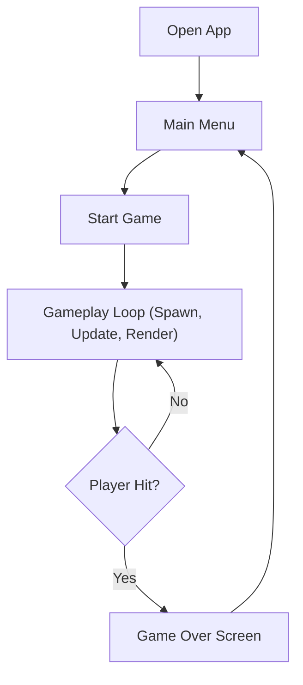

## 1. Product Overview
A highly optimized, mobile-friendly 2D space shooter web game.
- Provides a fast-paced, arcade-style shooting experience directly in the browser with touch controls for mobile.
- Serves as a visually stunning, performant HTML5 canvas game demonstrating high-quality web graphics and smooth gameplay.

## 2. Core Features

### 2.1 Feature Module
1. **Main Menu**: Start button, high score display, sound toggle.
2. **Game Engine**: Player ship, enemies, projectiles, particle explosions, parallax scrolling background.
3. **Game Over Screen**: Final score, restart button.

### 2.2 Page Details
| Page Name | Module Name | Feature description |
|-----------|-------------|---------------------|
| App View  | Game UI     | Holds the canvas and HTML overlays for menus and HUD |
| App View  | Canvas      | Handles 60FPS rendering of sprites and particles |
| App View  | Input Logic | Captures touch/drag events for mobile ship movement |

## 3. Core Process
The player starts the game, drags their finger/mouse to move the ship. The ship auto-fires. Enemies spawn at the top and move down. The player dodges and shoots them to gain score. If the player collides with an enemy, the game ends.

## 4. User Interface Design
### 4.1 Design Style
- Primary colors: Deep space black (`#050510`), neon cyan (`#00f3ff`), hot pink/magenta (`#ff0055`) for enemies.
- Button style: Retro-futuristic, neon-glowing borders, slightly rounded.
- Font: 'Orbitron' or similar sleek modern tech font.
- Layout style: Full-screen canvas with centered HTML UI overlays.
- Effects: Screen shake, particle explosions, starfield parallax.

### 4.2 Page Design Overview
| Page Name | Module Name | UI Elements |
|-----------|-------------|-------------|
| Game View | Overlay UI  | Absolute positioned divs with backdrop-blur, glowing text, simple clean buttons |
| Game View | Canvas      | Dynamic particle systems, glowing trails, smooth movement |

### 4.3 Responsiveness
- Automatically scales to fit any mobile screen aspect ratio.
- Touch events optimized: `touchstart`, `touchmove` with `e.preventDefault()` to stop scrolling.
