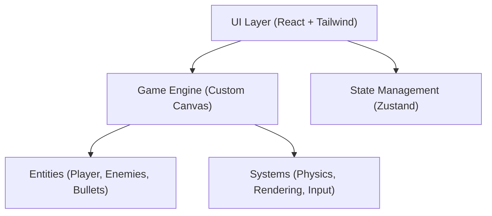

## 1. Architecture Design

## 2. Technology Description
- Frontend: React@18 + tailwindcss@3 + vite
- Initialization Tool: vite-init
- Rendering: Pure HTML5 Canvas API (for zero-dependency, highly optimized performance)
- State Management: Zustand (for score, game state: menu, playing, gameover)

## 3. Route Definitions
| Route | Purpose |
|-------|---------|
| /     | Main application holding the game and UI overlays |

## 4. Technical Optimizations
- **Object Pooling**: Pre-allocate arrays for bullets and particles to avoid Garbage Collection stutter.
- **Delta-Time**: Frame-rate independent movement.
- **Touch Handling**: Proper binding to canvas to ensure smooth dragging without browser interference.
- **DPI Scaling**: Support high-DPI (Retina) screens by scaling the canvas internal resolution.
